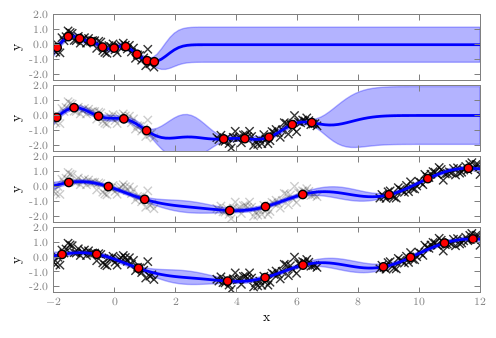

## Streaming sparse Gaussian process approximations

This repository contains an implementation of the online sparse GP approximations for regression and classification (Bui, Nguyen and Turner, NIPS 2017). In particular, [osvgp.py](code/osvgpc.py) implements the uncollapsed variational free-energy and [osgpr.py](code/osgpr.py) implements the collapsed variational free-energy and Power-EP energy for the regression case.

We also provide an implementation of the collapsed batch Power-EP sparse approximation of Bui, Yan and Turner (2017).

The code was tested using GPflow 0.4.0 and tensorflow 1.2 on a Linux machine and a Mac. Note that latest GPflow breaks backward-compatibility.

## Usage

We provide several test scripts ([regression](code/test_reg_toy.py) and [classification](code/test_cla_toy.py)) to demonstrate the usage. Running these examples should the results similar to the following figures:




## Contributors

Thang D. Bui, Cuong V. Nguyen and Richard E. Turner

## References: 

```
@inproceedings{BuiNguTur17,
  title =  {Streaming sparse {G}aussian process approximations},
  author =   {Bui, Thang D. and Nguyen, Cuong V. and Turner, Richard E.},
  booktitle = {Advances in Neural Information Processing Systems 30},
  year =   {2017}
}

@article{BuiYanTur16,
  title={A Unifying Framework for Sparse {G}aussian Process Approximation using {P}ower {E}xpectation {P}ropagation},
  author={Thang D. Bui and Josiah Yan and Richard E. Turner},
  journal={arXiv preprint arXiv:1605.07066},
  year={2016}
}
```